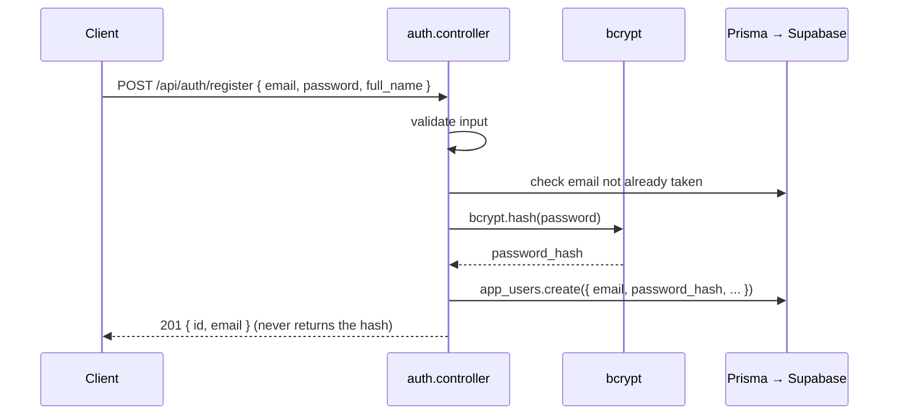
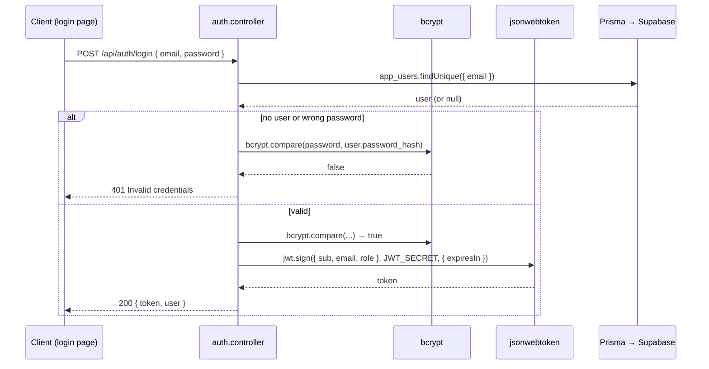
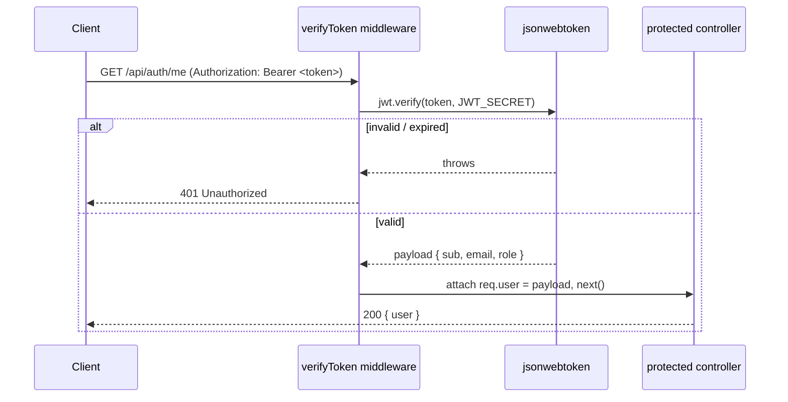

# JWT Authentication — Implementation Plan

> **This is a plan, not code.** Nothing here is implemented yet. It describes *how* JWT
> authentication will be built so we can agree on the approach first.

---

## 0. Guiding principle (per your decision)

**Supabase is used ONLY as the Postgres database.** We do **not** use Supabase Auth, the
`auth.users` table, or GoTrue. **All authentication is our own code** — we hash passwords with
`bcrypt`, store users in our own table, and issue/verify our own JWTs with `jsonwebtoken`.

That means:
- ❌ We will **not** read or write `auth.users`, `sessions`, `refresh_tokens`, or any `auth.*` table.
- ❌ The existing `public.profiles` table (which is wired to `auth.users`) will **not** be used for login.
- ✅ We add **one new table of our own** that we fully control.

---

## 1. Is the existing database enough? → **No. We need one new table.**

**Why the current tables don't work:**

| Table | Problem for our custom auth |
| --- | --- |
| `public.profiles` | Has **no `email`** and **no `password`** column. Also its `id` is a foreign key to `auth.users`, tying it to Supabase Auth — which we're not using. |
| `auth.users` | It *does* have email + `encrypted_password`, but it's **Supabase-managed** (GoTrue owns it, with its own hashing, triggers, RLS). We agreed not to touch it. |

**Conclusion:** create a **new, self-owned table** — proposed name **`app_users`** — that holds the
email and the bcrypt password hash. (`app_users`, not `users`, to avoid a name clash with Supabase's
existing `auth.users` model already in the Prisma schema.)

### Proposed `app_users` table

| Column | Type | Notes |
| --- | --- | --- |
| `id` | `uuid` (PK, default `gen_random_uuid()`) | Our own identifier — independent of Supabase Auth |
| `email` | `text`, **unique**, not null | Login identifier |
| `password_hash` | `text`, not null | **bcrypt hash** — never the plain password |
| `full_name` | `text`, nullable | Display name |
| `role` | `text`, not null, default `'viewer'` | Drives authorization (e.g. `viewer` / `admin`) |
| `created_at` | `timestamptz`, default `now()` | |
| `updated_at` | `timestamptz`, default `now()` | |

### How the table gets created (safely) via Prisma

Because the Prisma schema currently also contains Supabase's managed `auth.*` tables, running
`prisma migrate` is **risky** — it could try to "correct" those managed tables. The safe sequence:

1. Create the table with a **plain SQL statement** (Supabase SQL editor, or `prisma db execute`),
   scoped to `public` only:
   ```sql
   create table public.app_users (
     id            uuid primary key default gen_random_uuid(),
     email         text unique not null,
     password_hash text not null,
     full_name     text,
     role          text not null default 'viewer',
     created_at    timestamptz not null default now(),
     updated_at    timestamptz not null default now()
   );
   ```
2. `npx prisma db pull` → Prisma introspects and adds the `app_users` model to `schema.prisma`.
3. `npx prisma generate` → the client now exposes `prisma.app_users.*`.

This keeps Prisma as the query layer while never letting a migration touch Supabase's `auth` schema.

---

## 2. Authentication approach: **stateless JWT**

- On successful login, the server signs a **JWT** containing a minimal payload
  (`{ sub: user.id, email, role }`) using `JWT_SECRET` (already in `.env`), with an expiry
  (e.g. `1h` or `7d`).
- The client stores the token and sends it on every request in the
  **`Authorization: Bearer <token>`** header.
- Protected routes run a middleware that verifies the token's signature + expiry. **No session table
  is needed** — the token itself is the proof (that's what "stateless" means).
- Passwords are hashed with **bcrypt** before storing, and compared with `bcrypt.compare` on login.
  The plain password is never stored or logged.

**Token transport — recommendation:** `Authorization: Bearer` header (simplest for a React SPA + API;
needs no extra packages). The alternative is an `httpOnly` cookie (more resistant to XSS but needs
`cookie-parser` + CSRF handling). *Decision needed — see §7.*

---

## 3. API endpoints

| Method | Route | Auth? | Purpose |
| --- | --- | --- | --- |
| `POST` | `/api/auth/register` | public | Create an `app_users` row (hash password). *Needed so users exist — the table is currently empty.* |
| `POST` | `/api/auth/login` | public | Verify email + password → return a signed JWT |
| `GET`  | `/api/auth/me` | **protected** | Return the current user (decoded from the token) |
| `POST` | `/api/auth/logout` | protected | Optional — with stateless JWT this is mostly client-side (drop the token) |

*(If you don't want public self-registration, `register` can instead be an admin-only or a one-off
seed script — see §7.)*

---

## 4. How the flows work

### Register (creates a user)


### Login (issues a JWT)


### Accessing a protected route


---

## 5. Frontend — simple login page

A minimal page (`frontend/src/pages/Login.jsx`) with:
- An **email** field and a **password** field, plus a "Sign in" button.
- On submit → `POST http://localhost:5000/api/auth/login` with `{ email, password }`.
- On success → store the returned `token` (see §7 for where) and redirect to `/dashboard`.
- On failure → show "Invalid email or password".

Flow:
```
[ Login page ]  --email/password-->  POST /api/auth/login  -->  { token, user }
       |                                                              |
       └──────────────── store token, redirect to /dashboard ────────┘

[ Protected pages ]  attach  Authorization: Bearer <token>  on API calls
```

*(This re-creates a login page similar to the one removed earlier, but pointed at our own backend
instead of Supabase Auth.)*

---

## 6. Files that will be added (when we implement)

```
backend/server/src/
├── controllers/
│   └── auth.controller.js      # register, login, me
├── routes/
│   └── auth.routes.js          # POST /register, POST /login, GET /me
├── middlewares/
│   └── verifyToken.js          # checks Authorization: Bearer, sets req.user
│   └── requireRole.js          # optional: authorization by role
├── services/
│   └── auth.service.js         # bcrypt hashing + JWT sign/verify helpers
└── utils/
    └── (validation helpers, if needed)

backend/server/prisma/schema.prisma   # + app_users model (via db pull)
frontend/src/pages/Login.jsx          # simple email/password form
index.js                              # mount app.use('/api/auth', authRoutes)
```

**Dependencies:** already installed — `jsonwebtoken`, `bcrypt`, `express`, `cors`, `dotenv`,
`@prisma/client`. Nothing new needed (unless we choose the cookie approach → add `cookie-parser`).

---

## 7. Decisions needed from you before implementing

1. **Token storage on the frontend:**
   - **(A, recommended)** `Authorization: Bearer` header, token in memory / `localStorage` — simplest.
   - **(B)** `httpOnly` cookie — more secure vs XSS, but needs `cookie-parser` + CSRF handling.
2. **How do users get created?**
   - **(A)** A public `POST /api/auth/register` endpoint (self sign-up).
   - **(B)** Admin-only creation / a one-time seed script (no public sign-up).
3. **Token lifetime:** e.g. `1h`, `24h`, `7d`? (And do you want refresh tokens, or keep it simple with
   a single access token for now?)
4. **Roles:** just `viewer`/`admin`, or a specific set you have in mind for authorization?

---

## 8. Security notes (will be honored in implementation)

- Passwords hashed with bcrypt (cost factor 10–12); plain passwords never stored or logged.
- Login returns the **same** "invalid credentials" message whether the email or the password is
  wrong (avoids leaking which emails exist).
- `JWT_SECRET` stays in `.env` (already gitignored); tokens are signed, not encrypted, so **no
  secrets go in the payload**.
- Input validation on `email`/`password` before hitting the DB.
- CORS restricted to the frontend origin.
```
