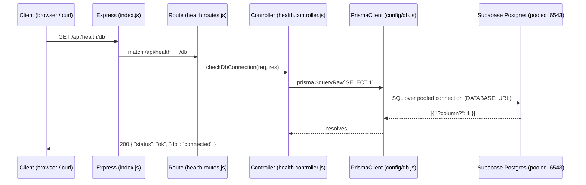

# Backend ↔ Database: Prisma + Supabase

This document explains **what is implemented so far** in the backend, **how Prisma connects to
Supabase**, the **schema** that was introspected, and **how a request flows** from the API down to
the database.

> Status: **Database connectivity is complete and verified.** No authentication / JWT logic exists
> yet — that is the next phase.

---

## 1. The stack

| Layer            | Technology                     | Role                                                        |
| ---------------- | ------------------------------ | ----------------------------------------------------------- |
| HTTP server      | **Express 5**                  | Routing, middleware, JSON parsing                           |
| CORS             | **cors**                       | Lets the Vite frontend call the API                         |
| Config           | **dotenv**                     | Loads `.env` into `process.env`                             |
| ORM / DB client  | **Prisma 6** (`@prisma/client`)| Typed query builder + connection management                 |
| Database         | **Supabase Postgres**          | Managed PostgreSQL (with a built-in `auth` schema)          |
| Password hashing | **bcrypt** *(installed, unused)* | Reserved for the upcoming auth phase                      |
| Tokens           | **jsonwebtoken** *(installed, unused)* | Reserved for the upcoming auth phase                |

Prisma is pinned to **v6** on purpose. Prisma **v7** removed `url`/`directUrl` from the schema file
and requires a separate `prisma.config.ts` plus a driver-adapter package — extra complexity we don't
need. v6 keeps the clean, schema-based configuration.

---

## 2. How Prisma connects to Supabase

Supabase gives **two** connection strings, and we use **both** — this is the key detail.

```
DATABASE_URL  → port 6543  → PgBouncer pooled connection  → used by the app at RUNTIME
DIRECT_URL    → port 5432  → direct Postgres connection    → used by Prisma CLI for schema work
```

**Why two?**

- **`DATABASE_URL` (port 6543, `?pgbouncer=true`)** — Supabase's connection **pooler** (PgBouncer).
  Serverless/long-running apps open many short connections; the pooler multiplexes them so Postgres
  isn't overwhelmed. This is what `PrismaClient` uses for every normal query at runtime.
- **`DIRECT_URL` (port 5432)** — a **direct** connection to Postgres, bypassing the pooler. Prisma's
  schema tools (`db pull`, `migrate`) need a direct connection because they run statements PgBouncer's
  transaction-pooling mode can't handle. Prisma only uses this during development/schema commands.

Both are declared in the datasource so Prisma automatically picks the right one for each job:

```prisma
datasource db {
  provider  = "postgresql"
  url       = env("DATABASE_URL")   // runtime queries (pooled)
  directUrl = env("DIRECT_URL")     // migrations / introspection (direct)
  schemas   = ["auth", "public"]    // see §4
}
```

### The `.env` (secrets — not committed)

```dotenv
DATABASE_URL="postgresql://postgres.<ref>:<url-encoded-password>@aws-1-ap-northeast-2.pooler.supabase.com:6543/postgres?pgbouncer=true"
DIRECT_URL="postgresql://postgres.<ref>:<url-encoded-password>@aws-1-ap-northeast-2.pooler.supabase.com:5432/postgres"
PORT=5000
JWT_SECRET=<random-string>   # reserved for the auth phase
```

> ⚠️ **Password must be URL-encoded.** The DB password contained `@` and `#`, which are reserved
> characters in a connection URL. They must be percent-encoded or Prisma mis-parses the host:
> `@` → `%40`, `#` → `%23`. (A stray `@` is why an early attempt tried to connect to a host named
> after part of the password.)

---

## 3. Project structure

```
backend/server/
├── .env                          # connection strings + secrets (gitignored)
├── index.js                      # app entry point — boots Express, mounts routes
├── prisma/
│   └── schema.prisma             # datasource + generator + 24 introspected models
└── src/
    ├── config/
    │   └── db.js                 # creates & exports the single PrismaClient instance
    ├── controllers/
    │   └── health.controller.js  # checkDbConnection() → runs SELECT 1
    ├── routes/
    │   └── health.routes.js       # GET /db → checkDbConnection
    ├── middlewares/              # (empty — for the auth phase)
    ├── services/                 # (empty — for business logic)
    └── utils/                    # (empty)
```

---

## 4. The schema

The schema was **introspected from the live database** (`prisma db pull`) rather than hand-written,
because the tables already exist in Supabase. Introspection produced **24 models**: your one
`public.profiles` table plus Supabase's entire managed `auth` schema (`users`, `sessions`,
`refresh_tokens`, `mfa_*`, `oauth_*`, etc.).

### Why `schemas = ["auth", "public"]`

`public.profiles` has a foreign key to `auth.users`. Postgres organizes tables into *schemas*, and
Prisma refuses to follow a cross-schema reference unless every schema involved is listed. Declaring
both schemas (multi-schema support) lets Prisma model the `profiles → users` relationship correctly.

### The table that matters: `profiles`

```prisma
model profiles {
  id         String    @id @db.Uuid              // same value as auth.users.id (1:1)
  full_name  String
  role       String?   @default("viewer")        // e.g. viewer / admin
  created_at DateTime? @default(now()) @db.Timestamptz(6)
  updated_at DateTime? @default(now()) @db.Timestamptz(6)
  users      users     @relation(fields: [id], references: [id], onDelete: Cascade)

  @@schema("public")
}
```

- `id` is **both** the primary key **and** the foreign key to `auth.users.id` — a profile *extends*
  a Supabase auth user rather than duplicating it.
- `role` drives the eventual **authorization** logic (who can do what).
- `onDelete: Cascade` — delete the auth user and the profile goes with it.

> The `auth.*` models exist in the schema so the relation resolves, but the app treats them as
> read-only. **Do not run `prisma migrate` casually** — it could try to alter Supabase's managed
> `auth` tables. We only used **introspection** (`db pull`), which is read-only and safe.

---

## 5. How a request flows (runtime)



**Startup order in `index.js` (important):**

```js
require('dotenv').config()               // 1. load .env FIRST
const express = require('express')
const healthRoutes = require('./src/routes/health.routes')
// ...
app.use('/api/health', healthRoutes)     // 2. mount routes
app.listen(PORT)                          // 3. listen
```

`dotenv` must run **before** anything imports `config/db.js`. Unlike the Prisma CLI, the Prisma
**Client does not auto-load `.env`** — it reads `process.env.DATABASE_URL` at construction time, so
that variable has to already be populated.

**Single client instance.** `config/db.js` creates **one** `PrismaClient` and exports it; every
controller imports that same instance. Creating a new client per request would exhaust the connection
pool.

---

## 6. The exact setup that was run (reproducible)

```bash
cd backend/server

# 1. Install Prisma (CLI + client), pinned to v6
npm install -D prisma@6
npm install @prisma/client@6

# 2. Introspect the existing Supabase DB → writes models into schema.prisma
npx prisma db pull

# 3. Generate the typed client from that schema
npx prisma generate

# 4. Runtime packages for the server
npm install express cors dotenv bcrypt jsonwebtoken
```

> Network note: this machine's corporate Fortinet proxy blocked `registry.npmjs.org` (TLS
> interception + `403`). Installs required a non-corporate network. If the cert error returns:
> `npm config set strict-ssl false` for the install, then set it back to `true`.

### Verification result

```
GET /api/health/db  →  { "status": "ok", "db": "connected" }

# direct client check:
SELECT 1          -> [{ "ok": 1 }]
profiles.count()  -> 0        (table reachable, currently empty)
```

---

## 7. Handy commands

| Command                    | What it does                                                        |
| -------------------------- | ------------------------------------------------------------------- |
| `npm run dev`              | Start the server with auto-reload (`node --watch index.js`)         |
| `npm start`                | Start the server once                                               |
| `npm run prisma:generate`  | Regenerate the client after schema changes                          |
| `npx prisma db pull`       | Re-introspect the DB (after changing tables in Supabase)            |
| `npx prisma studio`        | Open a GUI to browse/edit the data                                  |

---

## 8. Status & what's next

**Done**
- ✅ Prisma 6 installed and connected to Supabase (pooled + direct URLs)
- ✅ Existing schema introspected (`profiles` + `auth.*`), client generated
- ✅ Health endpoint proves live connectivity end-to-end

**Not started (next phase — awaiting your go-ahead)**
- ⏭️ Authentication (register / login using `bcrypt` for password hashing)
- ⏭️ Authorization (role checks via `profiles.role`)
- ⏭️ JWT issuing/verifying (`jsonwebtoken` + `JWT_SECRET`) — *explicitly deferred per instruction*
